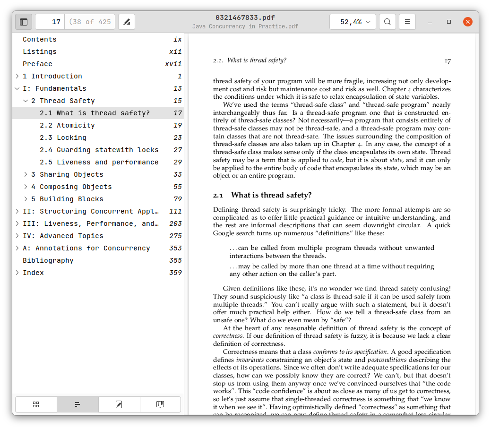
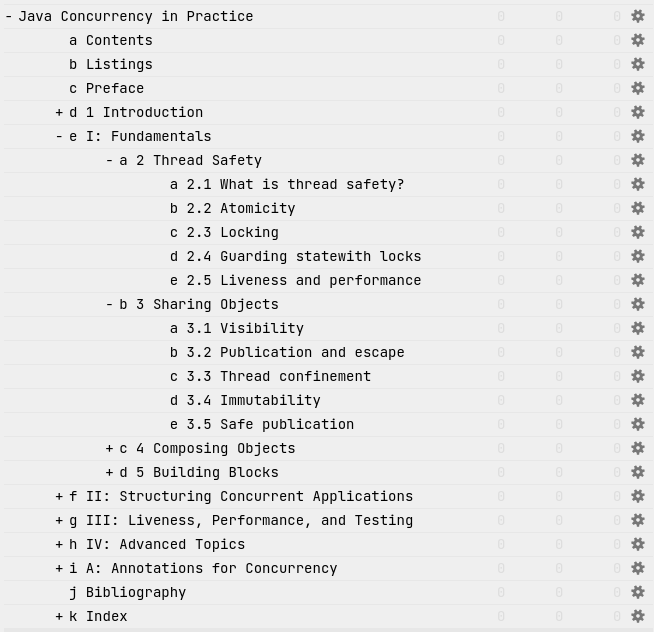
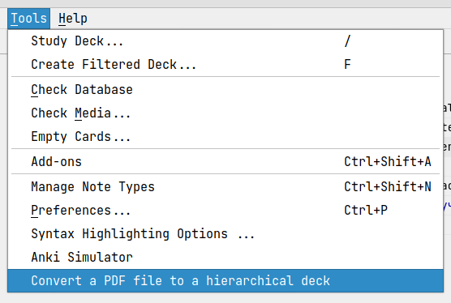

# Converter Of Book To Hierarchical Anki Deck

The [anki add-on](https://addon-docs.ankiweb.net/) to convert chapter titles (headers) of book to a hierarchical 
anki deck.

## Example

Your book as input:

The hierarchical anki deck as output:

## Download

Install this with Anki download code 2132327811.

## Use

Click on an action "Convert a PDF file to a hierarchical deck" from the "Tools" menu.

## Motivation

I wanted to write down my conclusions for each book chapter as anki-cards and keep them in the handy deck.

## FAQ

### What book formats does it support?

Only PDF files.

### I tried to use the add-on with my PDF file but it can't find headers. Why? 

Not all PDF files contain the titles as metadata so the add-on cannot process it. Try to find a different version of 
your PDF file, or you can make the titles yourself.

## Links to used resources

* PDF files in tests from https://github.com/sambitdash/PDFTest 
